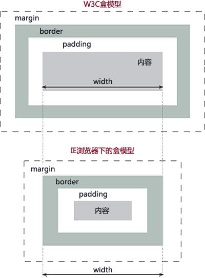

#### 常见的HTTP状态码
>HTTP状态码的英文为HTTP Status Code,状态码由3个10进制数组成,第一个10进制数代表状态码的类型,后两个数字代表详细的状态信息.

|分类|分类描述|
|-|-|
|1**|信息，服务器收到请求，需要请求者继续执行操作|
|2**|成功，操作被成功接收并处理|
|3**|重定向，需要进一步的操作以完成请求|
|4**|客户端错误，请求包含语法错误或无法完成请求|
|5**|服务器错误，服务器在处理请求的过程中发生了错误|


|状态码|状态码英文名称|中文描述|
|-|-|-|
|200|OK|请求成功。一般用于GET与POST请求|
|400|Bad Request|客户端请求的语法错误，服务器无法理解|
|401|Unauthorized|请求要求用户的身份认证|
|403|Forbidden|服务器理解请求客户端的请求，但是拒绝执行此请求|
|404|Not Found|服务器无法根据客户端的请求找到资源（网页）。通过此代码，网站设计人员可设置"您所请求的资源无法找到"的个性页面|
|405|Method Not Allowed|客户端请求中的方法被禁止|
|500|Internal Server Error|服务器内部错误，无法完成请求|
|502|Bad Gateway|作为网关或者代理工作的服务器尝试执行请求时，从远程服务器接收到了一个无效的响应|
|503|Service Unavailable|由于超载或系统维护，服务器暂时的无法处理客户端的请求。延时的长度可包含在服务器的Retry-After头信息中|


#### 是什么IE盒子模型、W3C盒子模型,他们有什么区别

> 可以看到唯一的区别width的计算方式不一样,避免触发IE盒模型的方法是使用<!DOCTYPE html>声明，告诉IE采用W3C盒子模型即可


#### 以下JS定义中,哪个是立即执行函数 -5
```
A.function methodName(){
    console.log("methodName");
}

B.var methodName = function(){
    console.log("methodName");
}

C.function(){
    console.log("methodName");
}

D.(function(){
    console.log("methodName");
})()
```
> 以上从A到D 分别是函数声明、函数表达式、匿名函数、立即函数


#### 以下代码执行结果会输出什么内容-5
```
for (var i = 0; i < 5; i++) {
  console.log(i);
}
```
> 0 1 2 3 4 (基础)

##### 以下代码执行结果会输出什么内容-10
```
for (var i = 0; i < 5; i++) {
  setTimeout(function() {
    console.log(i);
  }, 1000 * i);
}
```
> 由于setTimeout会延迟执行,而此时for循环已经执行到5,因此输出为 5个5

#### 以下代码执行结果会输出什么内容-10
```
for (var i = 0; i < 5; i++) {
  setTimeout((function(i) {
    console.log(i);
  })(i), i * 1000);
}
```
> 由于setTimeOut(function,value),而即使运行函数不是function,因此相当于setTimeout(undefine, i * 1000);但是立即函数会立刻执行.因此会瞬间输出0~4.

##### 以下代码执行结果会输出什么内容-15
```
for (var i = 0; i < 5; i++) {
  (function(i) {
    setTimeout(function() {
      console.log(i);
    }, i * 1000);
  })(i);
}
```
> 以上涉及闭包知识,会输出0~4

##### 以下代码执行结果会输出什么内容-15
```
for (var i = 0; i < 5; i++) {
  (function() {
    setTimeout(function() {
      console.log(i);
    }, i * 1000);
  })(i);
}
```
> 由于闭包内没有对i保持引用,会输出5个5

##### Promise是什么东西?

#### CSS相关
##### CSS中 display 有哪些属性值,他们的作用是什么
|属性|备注|
|-|-|
|inline|默认。此元素会被显示为内联元素，元素前后没有换行符|
|block|此元素将显示为块级元素，此元素前后会带有换行符。|
|none|此元素不会被显示（隐藏）|
|inline-block|行内块元素。（CSS2.1 新增的值）|
|list-item|此元素会作为列表显示|
|table|此元素会作为块级表格来显示（类似table），表格前后带有换行符|

##### display:none 与 visibility:hidden 的区别是什么？
>display : none 隐藏对应的元素，在文档布局中不再分配空间
visibility:hideen 隐藏对应的元素，在文档布局中仍保留原来的空间

##### 如何水平并且垂直居中一张背景图
> 设置 background-position:center;


#### 框架相关
##### 谈谈你对MVVM开发模式的理解
>在MVVM模型中,主要角色包含Model(数据模型),View(视图层)、ViewModel(逻辑层).
1. Model-数据与业务逻辑都在Model层定义
2. View -负责UI视图展示
3. ViewModel -负责监听Model中数据的变化并控制视图的更新,处理用户的交互操作

##### v-show 与 v-if 有什么区别？
>v-if 是真正的条件渲染，因为它会确保在切换过程中条件块内的事件监听器和子组件适当地被销毁和重建；也是惰性的：如果在初始渲染时条件为假，则什么也不做——直到条件第一次变为真时，才会开始渲染条件块。
v-show 就简单得多——不管初始条件是什么，元素总是会被渲染，并且只是简单地基于 CSS 的 “display” 属性进行切换。
所以，v-if 适用于在运行时很少改变条件，不需要频繁切换条件的场景；v-show 则适用于需要非常频繁切换条件的场景。

##### Vue 组件间通信有哪几种方式？
>（1）props / $emit  适用 父子组件通信
这种方法是 Vue 组件的基础，相信大部分同学耳闻能详，所以此处就不举例展开介绍。

>（2）ref 与 $parent / $children 适用 父子组件通信
ref：如果在普通的 DOM 元素上使用，引用指向的就是 DOM 元素；如果用在子组件上，引用就指向组件实例
$parent / $children：访问父 / 子实例

>（3）EventBus （$emit / $on）  适用于 父子、隔代、兄弟组件通信
这种方法通过一个空的 Vue 实例作为中央事件总线（事件中心），用它来触发事件和监听事件，从而实现任何组件间的通信，包括父子、隔代、兄弟组件。

>（4）$attrs/$listeners 适用于 隔代组件通信
$attrs：包含了父作用域中不被 prop 所识别 (且获取) 的特性绑定 ( class 和 style 除外 )。当一个组件没有声明任何 prop 时，这里会包含所有父作用域的绑定 ( class 和 style 除外 )，并且可以通过 v-bind="$attrs" 传入内部组件。通常配合 inheritAttrs 选项一起使用。
$listeners：包含了父作用域中的 (不含 .native 修饰器的)  v-on 事件监听器。它可以通过 v-on="$listeners" 传入内部组件

>（5）provide / inject 适用于 隔代组件通信
祖先组件中通过 provider 来提供变量，然后在子孙组件中通过 inject 来注入变量。 provide / inject API 主要解决了跨级组件间的通信问题，不过它的使用场景，主要是子组件获取上级组件的状态，跨级组件间建立了一种主动提供与依赖注入的关系。

>（6）Vuex  适用于 父子、隔代、兄弟组件通信
Vuex 是一个专为 Vue.js 应用程序开发的状态管理模式。每一个 Vuex 应用的核心就是 store（仓库）。“store” 基本上就是一个容器，它包含着你的应用中大部分的状态 ( state )。

>Vuex 的状态存储是响应式的。当 Vue 组件从 store 中读取状态的时候，若 store 中的状态发生变化，那么相应的组件也会相应地得到高效更新。
改变 store 中的状态的唯一途径就是显式地提交  (commit) mutation。这样使得我们可以方便地跟踪每一个状态的变化。

##### 什么时候适合用methods，什么时候适合用computed，什么时候适合用watch
>computed： 是计算属性，依赖其它属性值，并且 computed 的值有缓存，只有它依赖的属性值发生改变，下一次获取 computed 的值时才会重新计算 computed  的值；
watch： 更多的是「观察」的作用，类似于某些数据的监听回调 ，每当监听的数据变化时都会执行回调进行后续操作；
运用场景：
当我们需要进行数值计算，并且依赖于其它数据时，应该使用 computed，因为可以利用 computed 的缓存特性，避免每次获取值时，都要重新计算；
当我们需要在数据变化时执行异步或开销较大的操作时，应该使用 watch，使用 watch 选项允许我们执行异步操作 ( 访问一个 API )，限制我们执行该操作的频率，并在我们得到最终结果前，设置中间状态。这些都是计算属性无法做到的。


扩展链接(以上内容来源于)
[最佳实践-Liril-Excuse me？这个前端面试在搞事!](https://zhuanlan.zhihu.com/p/25407758)

[30 道 Vue 面试题，内含详细讲解（涵盖入门到精通，自测 Vue 掌握程度）](https://juejin.im/post/5d59f2a451882549be53b170)

[CSS经典面试题](https://juejin.im/post/5cc59e41e51d456e62545b66)

[前端面试整理](https://www.one-tab.com/page/DUzvPkoFTy67kYevpvS2WQ)